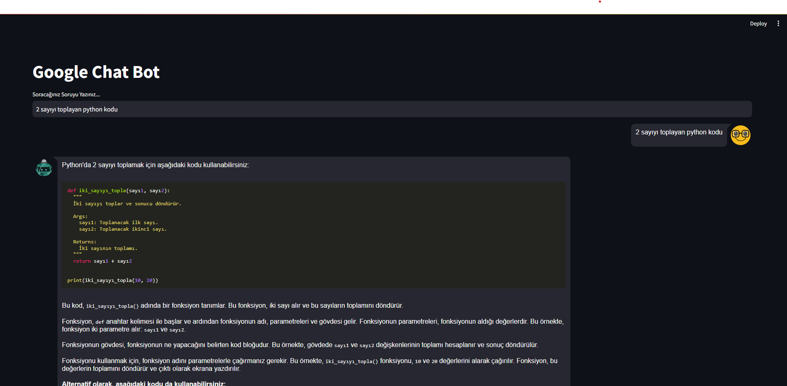

# chat-bot



<hr/>

<h3>Run the Project</h3>

<h5>Clone : </h5>

```
git clone https://github.com/yavuzim/chat-bot.git
```

<h5>Install Streamlit :</h5>

```
pip install streamlit
```

<h5>Install Streamlit Chat : </h5>

```
pip install streamlit-chat
```

<h5>Add to Your Project : </h5>

```
import streamlit as st
from streamlit_chat import message
```

<h5>Run the Streamlit Application : </h5>

```
streamlit run main.py
```
